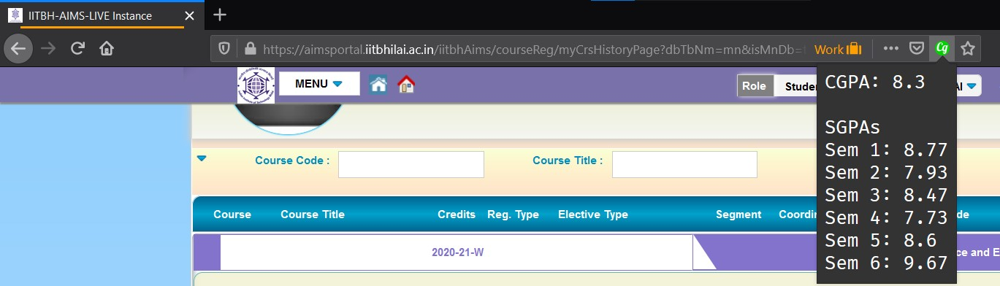

# IITBh CGPA

A browser extension that calculates CGPA directly from IIT Bhilai's AIMS Portal.

## Installation

Get it from your extension store.

  

  

## Usage

Click on the extension logo when on AIMS portal's courses page to see your CGPA and SGPAs.
